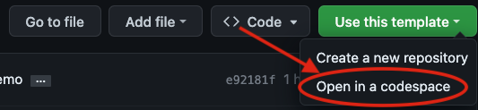
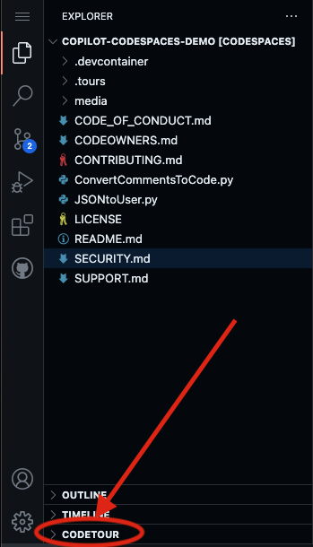
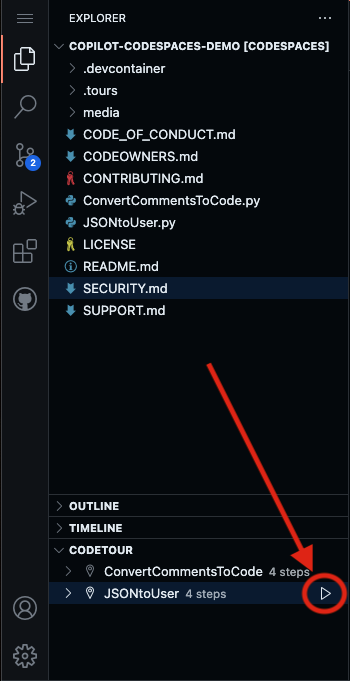

# Getting Started

1. To get started, start by selecting 'Use this template', and 'Open in a codespace'

2. Once the codespace has loaded, select 'Codetour' on the lower left corner, and start the JSONtoUser tour!

3. Next, select the play button for one of the tours listed. Enjoy!

## Codespace configuration

[devcontainer.json](../../.devcontainer/devcontainer.json) is the configuration file that sets up the Codespace. This file is used to specify the image, port, and extensions to be installed in the Codespace.
